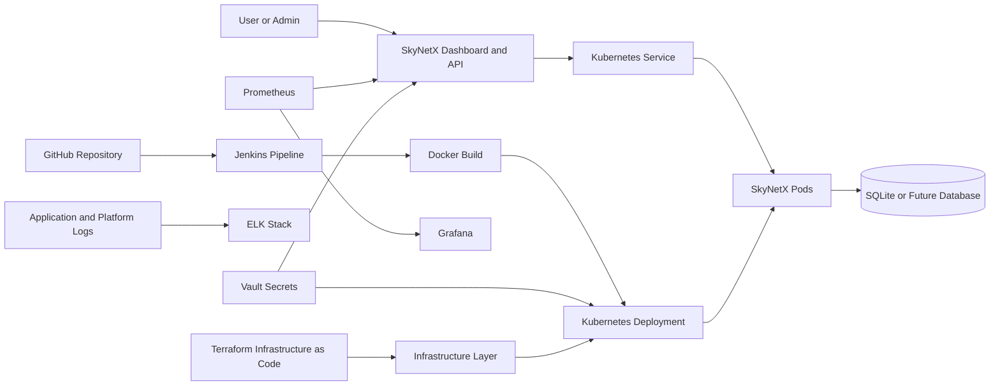

# SkyNetX Architecture Diagram

```mermaid
flowchart LR
    U[User or Admin] --> A[SkyNetX Dashboard and API]
    A --> S[Kubernetes Service]
    S --> P[SkyNetX Pods]
    P --> D[(SQLite or Future Database)]

    G[GitHub Repository] --> J[Jenkins Pipeline]
    J --> B[Docker Build]
    B --> K[Kubernetes Deployment]
    K --> P

    M[Prometheus] --> A
    M --> GR[Grafana]

    L[Application and Platform Logs] --> E[ELK Stack]

    V[Vault Secrets] --> K
    V --> A

    T[Terraform Infrastructure as Code] --> I[Infrastructure Layer]
    I --> K
```
