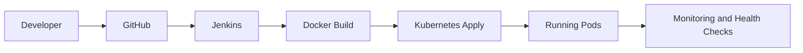

# SkyNetX Deployment Diagram

```mermaid
flowchart LR
    D[Developer] --> G[GitHub]
    G --> J[Jenkins]
    J --> DB[Docker Build]
    DB --> KA[Kubernetes Apply]
    KA --> RP[Running Pods]
    RP --> MO[Monitoring and Health Checks]
```
